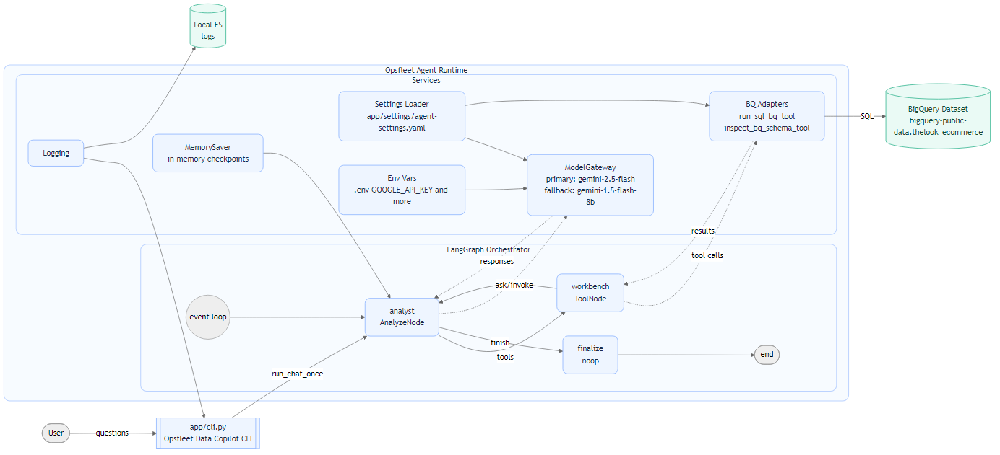

# Opsfleet Data Copilot

AI agent that turns natural‑language questions into **safe BigQuery SQL**, runs them against the public dataset **`bigquery-public-data.thelook_ecommerce`**, and returns **clear, structured insights**.

This implementation was built to satisfy the “AI Technical Assignment – Data Analysis LangGraph Agent” by Opsfleet.
---

## Overview

The agent accepts questions like:

- “Customer segmentation and behavior analysis”  
- “Product performance and recommendation insights”  
- “Sales trends and seasonality patterns”  
- “Geographic sales patterns”  

It then:
1) interprets the intent,  
2) generates **safe, strong SQL**,  
3) runs it on **BigQuery**, and  
4) summarizes the results into a concise business answer.

By default the CLI prints **the final agent answer**.

---

## Architecture

### LangGraph orchestration



```
analyst → workbench → analyst → finalize
```

**What each stage does:**

1. **`analyst` (first pass)** — Interprets the user’s request and decides what analysis and data are needed (e.g., “revenue trend”, “top products”, “segment by country”). It chooses which tool(s) to call.  
2. **`workbench`** — Executes tools (primarily the BigQuery adapter) under strict safeguards (see Safety Rules below).  
3. **`analyst` (second pass)** — Interprets the tabular result returned by tools and converts it into clear findings and recommendations.  
4. **`finalize`** — Returns a single, polished message to the CLI.

This **reason → act → reflect** loop mirrors how a human data analyst iterates on a question.

### Key components

- **CLI** (`app/cli.py`) — Minimal interface to start chat sessions and run BigQuery checks.  
- **Orchestration** (`app/orchestration/...`) — LangGraph state, nodes, and one‑turn runner.  
- **BigQuery adapters** (`app/orchestration/adapters/bq_tools.py`) — Safe query executor (`run_sql_bq_tool`) and schema inspector (`inspect_bq_schema_tool`).  
- **Model gateway** (`app/backends/model_gateway.py`) — Uses **Gemini** via Google API:  
  - primary: `gemini-2.5-flash`  
  - fallback: `gemini-1.5-flash-8b`  
- **Settings loader** (`app/boot/load_settings.py`) — Merges YAML config and CLI flags.  
- **BigQuery runner** (`app/backends/bq_runner.py`) — Thin wrapper around the BigQuery client.

---

## Safety rules (SQL & cost control)

To keep queries fast, predictable, and within free‑tier limits, the BigQuery tool enforces:

- **Read‑only** — query must start with `SELECT`  
- **No wildcards** — `SELECT *` is blocked  
- **Explicit cap** — a numeric `LIMIT` is required and must be **≤ 1000**  
- **Dry‑run guard** — if BigQuery’s dry‑run estimates **> 1 GiB** scanned, the query is refused

If a query violates any rule, the agent explains why and proposes a safer alternative.

---

## Configuration

Create a `.env` file in the project root:

```dotenv
GOOGLE_API_KEY=your_google_ai_studio_key
```

Edit `app/settings/agent-settings.yaml` to set your GCP project and dataset:

```yaml
bigquery:
  project_id: your_gcp_project              # e.g., my-gcp-project
  dataset_id: bigquery-public-data.thelook_ecommerce


.... -> (Remaining features can be kept same or modified)

```

Notes:
- The dataset is public, but the BigQuery client still runs under your GCP project for billing context. Google’s free tier is sufficient for this challenge.  
- Application Default Credentials or a configured environment are assumed for BigQuery access.  

---

## Setup

Create and activate a virtual environment, then install dependencies:

```bash
python -m venv .venv
# Windows
.venv\Scripts\activate
# macOS/Linux
source .venv/bin/activate

pip install -r requirements.txt
```
---

## Running

**Check BigQuery connectivity and view schemas**

```bash
python -m app.cli check-bq
```

**Start a chat session with the agent**

```bash
python -m app.cli chat
```

> You can add `-v` to either command if you want to see verbose logs during development.

**Example prompts**

- `Customer segmentation and behavior analysis`  
- `Product performance and recommendation insights`  
- `Sales trends and seasonality patterns`  
- `Geographic sales patterns`  

The CLI prints a **single, readable final answer** by default.


---

